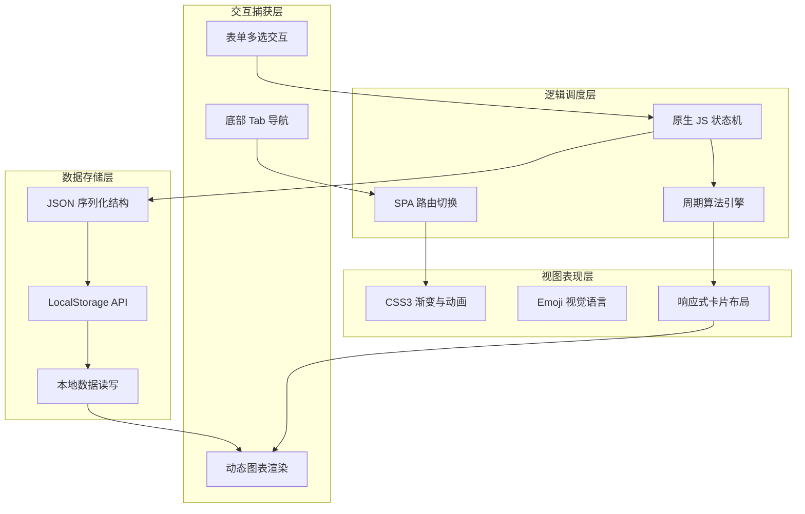

<div align="center">


<br/>


<br/><br/>

> 🌸 倾听身体的潮汐，做自己的周期管家。

**月韵 · 周期管家**
A Pure Aesthetic Menstrual Cycle Tracker — 一款专为女性设计的极简与美学并存的纯原生经期追踪单页应用。

<br/>

🌐 [项目预览](#-项目愿景) ·
✨ [核心特性](#-核心特性) ·
🛠️ [技术架构](#-技术架构) ·
🎨 [视觉系统](#-视觉系统) ·
🚀 [快速开始](#-快速开始)

</div>

---

## 📑 目录

- [🌟 项目愿景](#-项目愿景)
- [✨ 核心特性](#-核心特性)
- [🛠️ 技术架构](#-技术架构)
- [🎮 功能模块](#-功能模块)
- [🎨 视觉系统](#-视觉系统)
- [🔐 隐私与数据安全](#-隐私与数据安全)
- [📦 项目结构](#-项目结构)
- [🚀 快速开始](#-快速开始)
- [📱 浏览器兼容性](#-浏览器兼容性)
- [🤝 贡献指南](#-贡献指南)
- [🗺️ 开发路线](#-开发路线)
- [📄 开源协议](#-开源协议)
- [🙏 致谢](#-致谢)

---

## 🌟 项目愿景

在这个数据被滥用的时代，**月韵**致力于提供一个无需注册、无需联网、零数据上传的纯净空间。我们通过纯原生的 Web 技术，将冰冷的医学数据转化为充满温度的周期伴侣。不仅是记录，更是对身体节律的深度感知与温柔陪伴。

---

## ✨ 核心特性

| 维度 | 说明 |
|:---:|:---|
| 🌸 全状态感知 | 动态展示卵泡期、黄体期、排卵期、月经期四大阶段，实时同步身体状态（如"卵泡期第7天 · 精力回升 · 创造力旺盛"） |
| 📅 智能预测引擎 | 基于历史数据自动推算下次月经日期与排卵期窗口，让期待不再盲目 |
| 📝 多维度记录 | 涵盖 8 大常见症状、3 档流量、5 种情绪状态及自定义备注，全面刻画每日身体切片 |
| 📊 数据可视洞察 | 自动统计周期数、平均周期长度、最短/最长极值；记录 3 个周期以上自动生成趋势图表 |
| 💡 千人千面建议 | 根据当前所处周期阶段，动态生成针对性的健康、饮食、运动与睡眠建议 |
| 🔐 绝对隐私 | 所有数据仅存储于浏览器本地，不向任何服务器发送一字节，真正属于你的私密日记 |
| ⚡ 零依赖单文件 | 纯原生 HTML + CSS + JS，无任何框架与第三方库，单文件即可完整运行 |

---

## 🛠️ 技术架构

本项目采用原生 SPA（单页应用）架构，通过状态机管理视图切换，使用 LocalStorage 作为持久化数据库，展现了深厚的原生 JS 控制能力。



### 技术栈一览

| 层级 | 技术 | 选型理由 |
|:---:|:---|:---|
| **UI 渲染** | 原生 HTML5 + CSS3 | 摆脱框架束缚，实现极致的像素级控制与渐变美学 |
| **逻辑调度** | Vanilla JavaScript ES6+ | 模块化封装，状态机驱动视图更新，无运行时开销 |
| **数据存储** | Web Storage API | 利用 LocalStorage 实现客户端持久化，保障绝对隐私 |
| **视觉设计** | Emoji + CSS Flexbox | 用温和的 Emoji 传递情绪，用流畅的 Flexbox 构筑柔美卡片 |
| **应用架构** | Single Page Application | 无刷新页面切换，丝滑的底部导航交互体验 |

---

## 🎮 功能模块

### 🏠 首页 · 周期全景

实时展示当前所处阶段及天数，用诗意的文案描述身体状态（如"身体正在复苏 · 精力回升 · 创造力旺盛"），并提供下次月经与排卵期的智能倒计时。

### 📝 记录 · 多维身体切片

提供极其详尽的每日状态录入：

| 记录维度 | 可选值 |
|:---|:---|
| 📅 **日期** | 月经开始日期精确选择 |
| 💊 **症状（8 种）** | 腹痛 / 头痛 / 疲劳 / 情绪波动 / 乳房胀痛 / 腰酸 / 食欲变化 / 失眠 |
| 🌊 **流量** | 轻 / 中 / 重 |
| 😊 **情绪（5 种）** | 开心 / 平静 / 低落 / 焦虑 / 烦躁 |
| 📝 **备注** | 自定义文字记录当日小事 |

### 📊 统计 · 数据洞察矩阵

自动聚合本地数据，展示：
- 累计记录的周期数
- 平均周期天数
- 最短与最长周期极值
- **趋势图表**：当记录数据超过 3 个周期，自动生成可视化周期波动曲线，洞察身体的潜在节律

### 💡 建议 · 个性化伴侣

基于当前所处的周期阶段（卵泡期、黄体期等），智能匹配针对性的健康指南，涵盖水分摄入、运动建议、睡眠质量提醒。倡导"倾听身体的声音，给自己多一些温柔"。

---

## 🎨 视觉系统

### 配色方案：樱花粉与治愈系

| 颜色 | 用途 | HEX | 色块 |
|:---:|:---:|:---:|:---:|
| 🌸 樱花粉 | 主色调 / 强调 | `#FF69B4` |  |
| 🌱 复苏绿 | 健康状态 / 卵泡期 | `#8BC34A` |  |
| 🥚 暖阳橙 | 排卵期 / 提醒 | `#FF9800` |  |
| 🩸 胭脂红 | 月经期 / 重要 | `#E53935` |  |
| ⚪ 米白 | 背景基色 | `#FAFAFA` |  |

### 视觉语言设计

- 🌸 **Emoji 情绪化** — 大量使用柔和的 Emoji，打破传统医疗 App 的冰冷感
- 🗂️ **卡片式呼吸** — 柔和的阴影与圆角设计，界面拥有呼吸感与生命力
- 🎯 **底部悬浮导航** — 符合移动端操作习惯的底部导航栏，随时随地切换模块
- 📝 **状态化交互** — 多选症状采用药丸式标签，选中态带有柔和的色彩反馈

---

## 🔐 隐私与数据安全

> ⚠️ **本项目绝不上传任何用户数据！**


本项目无需账号登录，所有敏感的健康记录、情绪状态、周期数据均存储于您本设备的浏览器 LocalStorage 中。关闭浏览器、断开网络，数据依然安全无虞。

---

## 📦 项目结构

```
moon-rhythm/
├── index.html      # 🌸 核心文件：HTML 结构 + CSS 样式 + JS 状态机引擎全集成
├── README.md       # 📖 项目文档（本文件）
└── LICENSE         # 📄 MIT 开源协议
```

---

## 🚀 快速开始

### 方式一：🌐 在线体验

点击链接，即刻拥抱你的周期伴侣：

👉 **[ https://aventardo7777.github.io/Luna-Flow/]( https://aventardo7777.github.io/Luna-Flow/)**

### 方式二：💻 本地运行

```bash
# 1. 克隆仓库
git clone https://github.com/Aventardo7777/moon-rhythm.git

# 2. 进入目录
cd moon-rhythm

# 3. 双击 index.html，浏览器自动打开即可使用
```

无需任何构建工具，无需安装 Node.js 或 Python，所见即所得。

---

## 📱 浏览器兼容性

| 浏览器 | 最低版本 | 状态 | 评级 |
|:---:|:---:|:---:|:---:|
| **Chrome** | 80+ | ✅ 完美支持 | ⭐⭐⭐⭐⭐ |
| **Safari** | 13+ | ✅ 完美支持 | ⭐⭐⭐⭐⭐ |
| **Edge** | 80+ | ✅ 完美支持 | ⭐⭐⭐⭐⭐ |
| **Firefox** | 75+ | ✅ 支持 | ⭐⭐⭐⭐ |
| **Opera** | 67+ | ✅ 支持 | ⭐⭐⭐⭐ |
| **IE** | — | ❌ 彻底不支持 | ❌ |

---

## 🤝 贡献指南

欢迎为月韵添砖加瓦！无论是 UI 美化、算法优化还是新功能提案，我们都热烈欢迎。

```bash
# 1. Fork 本仓库

# 2. 创建特性分支
git checkout -b feature/symptom-chart

# 3. 提交修改
git commit -m "feat: 新增 PMS 症状雷达图"

# 4. 推送
git push origin feature/symptom-chart
```

### 提交规范

| 前缀 | 用途 |
|:---:|:---|
| `feat:` | 新功能（如新增症状选项） |
| `fix:` | Bug 修复（如计算排卵期日期偏差） |
| `perf:` | 性能优化 |
| `style:` | 视觉样式微调 |
| `docs:` | 文档更新 |

---

## 🗺️ 开发路线

### ✅ v1.0 已完成

- [x] 核心周期追踪算法
- [x] 四大阶段状态感知与文案展示
- [x] 8 种症状 / 3 档流量 / 5 种情绪录入
- [x] 基础统计数据（平均周期 / 极值）
- [x] 阶段性个性化建议
- [x] LocalStorage 本地持久化
- [x] 底部导航 SPA 单页架构

### 🔜 v2.0 计划中

- [ ] 记录 3 周期后的 Canvas 趋势图表渲染
- [ ] 引入体温基础（BBT）追踪与排卵精准预测
- [ ] 提醒推送 Notification API 接入
- [ ] 更多可爱主题切换（樱花 / 星空 / 森林）
- [ ] PWA 离线应用支持
- [ ] 健康知识社区与文章分享

---

## 📄 开源协议

本项目基于 [**MIT License**](LICENSE) 开源协议发布。

```
MIT License

Copyright (c) 2024 Aventardo7777

Permission is hereby granted, free of charge, to any person obtaining a copy
of this software and associated documentation files (the "Software"), to deal
in the Software without restriction, including without limitation the rights
to use, copy, modify, merge, publish, distribute, sublicense, and/or sell
copies of the Software, and to permit persons to whom the Software is
furnished to do so, subject to the following conditions:

The above copyright notice and this permission notice shall be included in all
copies or substantial portions of the Software.

THE SOFTWARE IS PROVIDED "AS IS", WITHOUT WARRANTY OF ANY KIND, EXPRESS OR
IMPLIED, INCLUDING BUT NOT LIMITED TO THE WARRANTIES OF MERCHANTABILITY,
FITNESS FOR A PARTICULAR PURPOSE AND NONINFRINGEMENT. IN NO EVENT SHALL THE
AUTHORS OR COPYRIGHT HOLDERS BE LIABLE FOR ANY CLAIM, DAMAGES OR OTHER
LIABILITY, WHETHER IN AN ACTION OF CONTRACT, TORT OR OTHERWISE, ARISING FROM,
OUT OF OR IN CONNECTION WITH THE SOFTWARE OR THE USE OR OTHER DEALINGS IN THE
SOFTWARE.
```

> 允许个人学习、商用二次开发，仅需保留原作者标注。

---

## 🙏 致谢

- 🌸 灵感来源于每一位珍爱自己身体的女性
- 📊 感谢医学常识对周期算法的支持
- 💻 感谢纯原生 Web 技术赋予应用的无限可能性
- 💜 感谢所有关注女性健康与数字隐私的开发者

---

## ⭐ Star History

<div align="center">

[](https://star-history.com/#Aventardo7777/moon-rhythm&Date)

</div>

---

<div align="center">

**如果月韵为你带来了一丝温暖，请给一个 ⭐ Star！**

<br/>


<br/>

<sub>🌸 Crafted with care by [Aventardo7777](https://github.com/Aventardo7777) · Powered by Vanilla JS & Pure Aesthetics</sub>

<sub>Last updated: 2024</sub>

</div>
